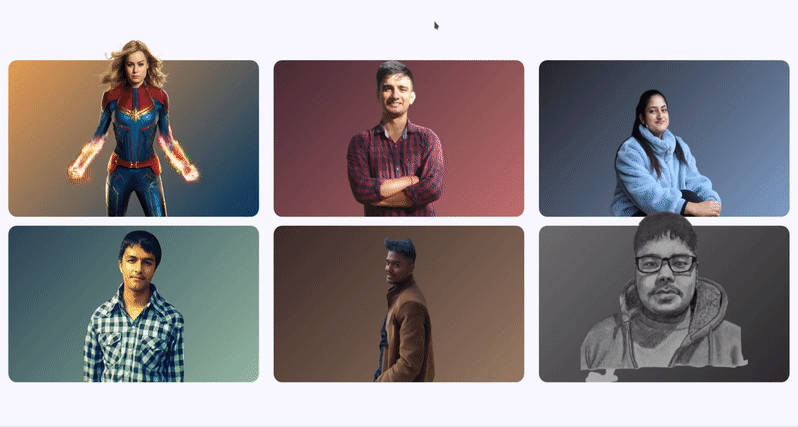

# Fronted Mini Projects

This is a collection **modular** and **optimized** fronted related mini-projects. I have build these projects using **HTML, CSS, JavaScript** and **VueJS.**

---

## [Neon Buttons](https://sagyamthapa.me/Frontend-Mini-Projects/neon-light-buttons/)

## [Card Hover Effect 1](https://sagyamthapa.me/Frontend-Mini-Projects/card-hover-effect-1/)

## [Card Hover Effect 2](https://sagyamthapa.me/Frontend-Mini-Projects/card-hover-effect-2/)

## [Animated Landing Page](https://sagyamthapa.me/Frontend-Mini-Projects/animated-landing-page/)

## [Line through Effect](https://sagyamthapa.me/Frontend-Mini-Projects/line-through-effect/)

## [Shopping Cart System](https://sagyamthapa.me/Frontend-Mini-Projects/vue-shopping-cart/)

## [Particle System](https://sagyamthapa.me/Frontend-Mini-Projects/particle-system/)

## [TailwindCSS](https://sagyamthapa.me/Frontend-Mini-Projects/tailwindcss-demo)

